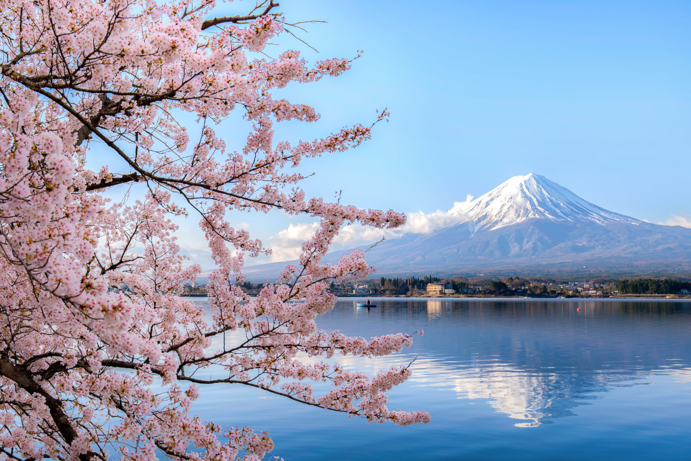
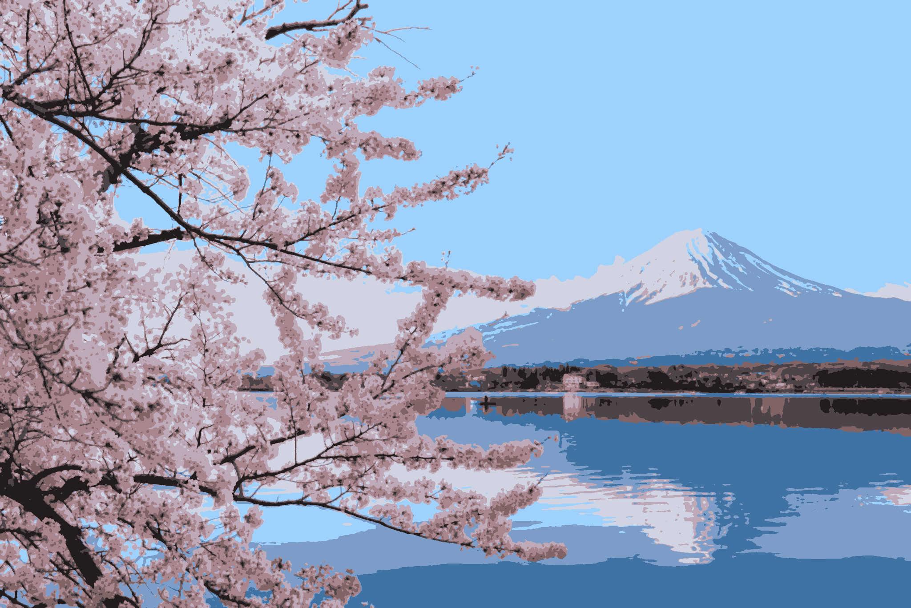
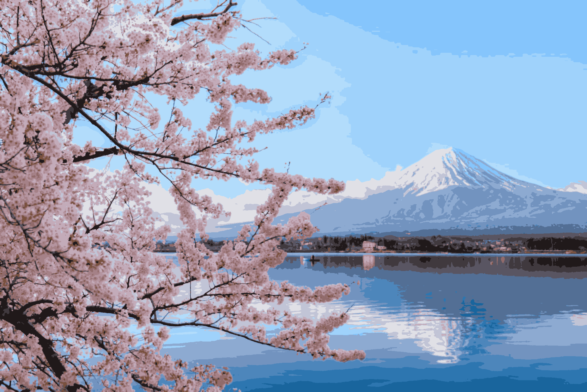
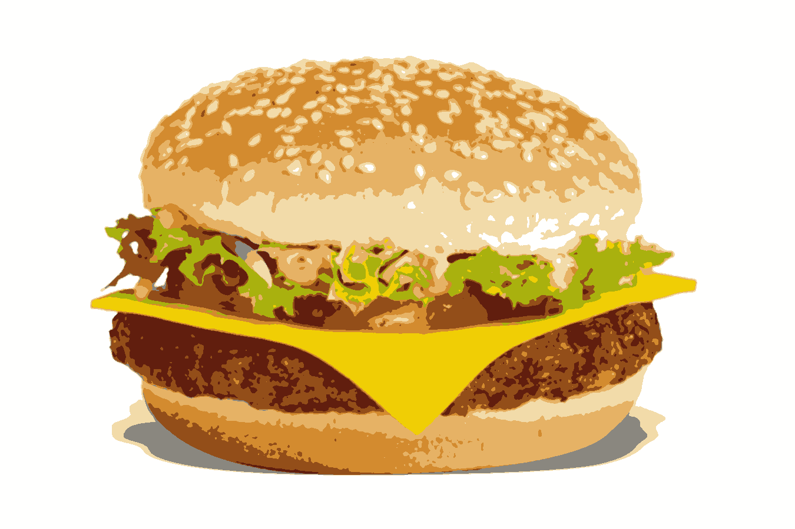
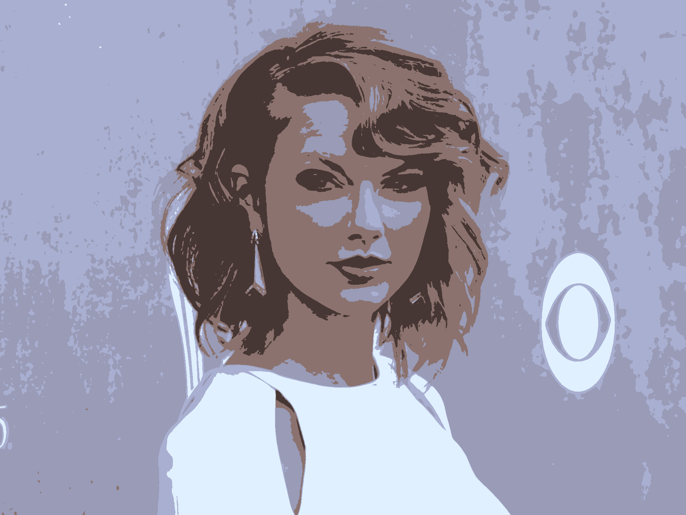
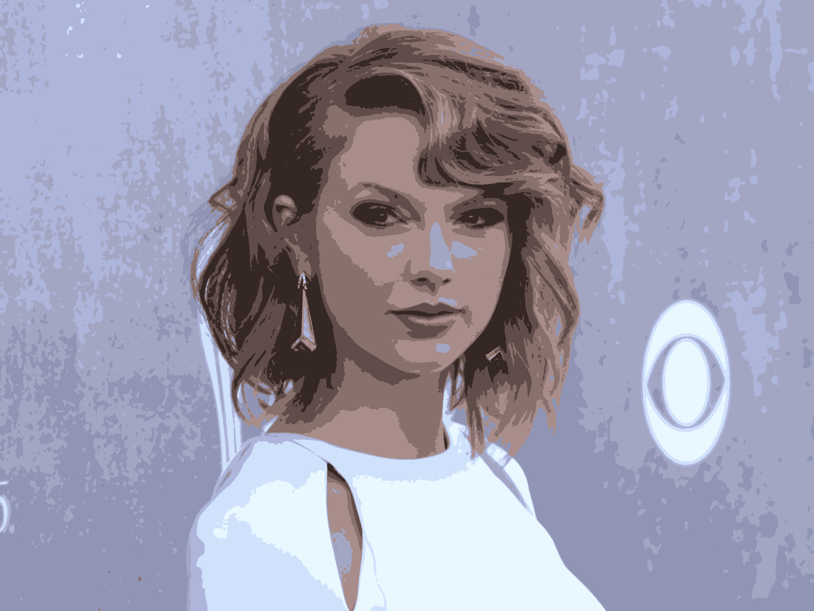
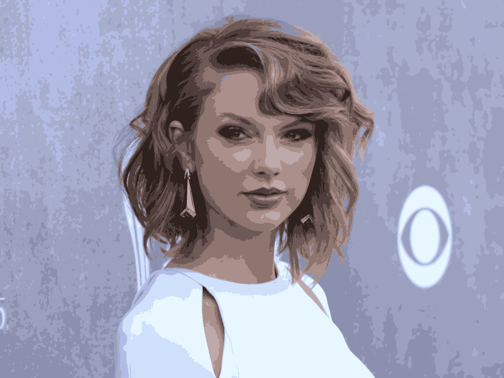
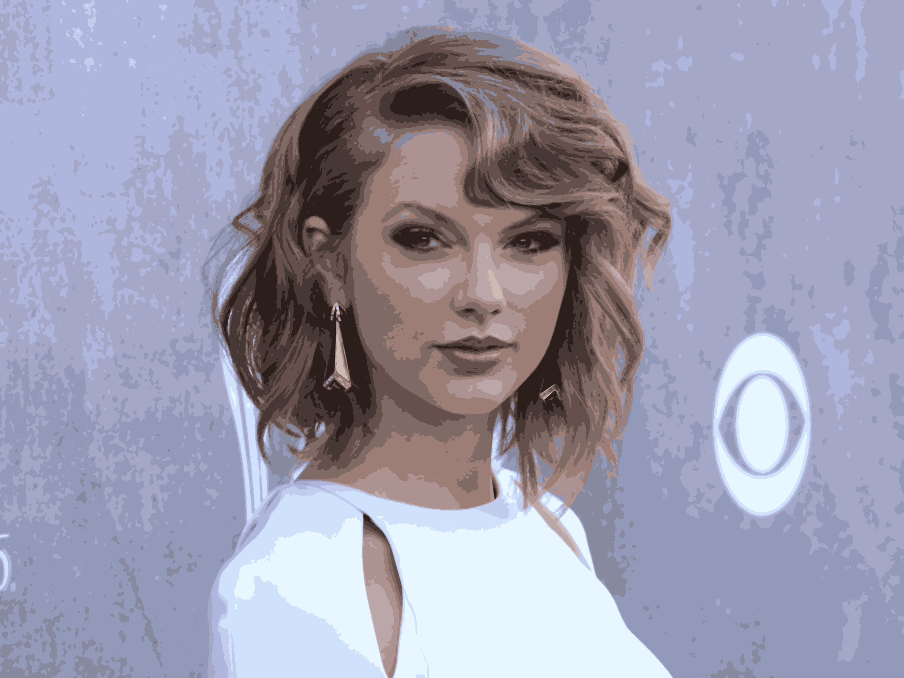

# Cartoon-Images
An image processing project for images cartoonization

## Traditional Image Processing Method

#### 1.  Here are few examples of image quantization using K-means algorithm on different images :

* **Drake's face :**

Image to process           |           K = 5           |            K = 9          | K = 12 | K = 15 | K = 19 | Best Image (K = 7)
:-------------------------:|:-------------------------:|:-------------------------:|:-------------------------:|:-------------------------:|:-------------------------:|:-------------------------:|
   | |  |  |  |  | 

 

* **Japan landscape :**

Image to process           |           K = 5           |            K = 9          | K = 12 | K = 15 | K = 19 | Best Image (K = 9)
:-------------------------:|:-------------------------:|:-------------------------:|:-------------------------:|:-------------------------:|:-------------------------:|:-------------------------:|
   | |  |  |  |  | 

 

* **A burger :**

Image to process           |           K = 5           |            K = 9          | K = 12 | K = 15 | K = 19 | Best Image (K = 15)
:-------------------------:|:-------------------------:|:-------------------------:|:-------------------------:|:-------------------------:|:-------------------------:|:-------------------------:|
   | |  |  |  |  | 

 

* **Taylor Swift's face :**

Image to process           |           K = 5           |            K = 9          | K = 12 | K = 15 | K = 19 | Best Image (K = 19)
:-------------------------:|:-------------------------:|:-------------------------:|:-------------------------:|:-------------------------:|:-------------------------:|:-------------------------:|
  | |  |  |  |  | 

#### 2.  Here are few examples of edge enhancement on quantized images :
